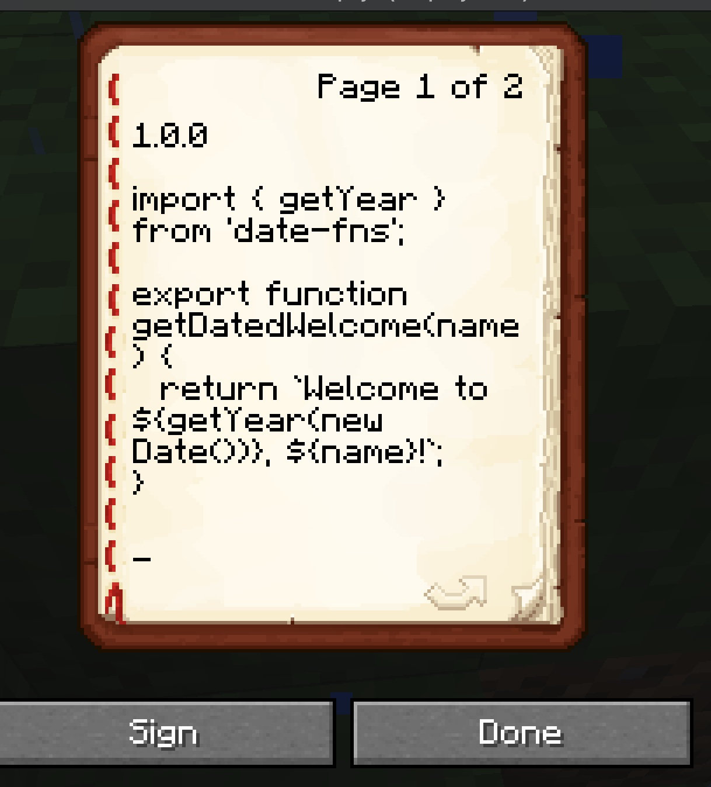
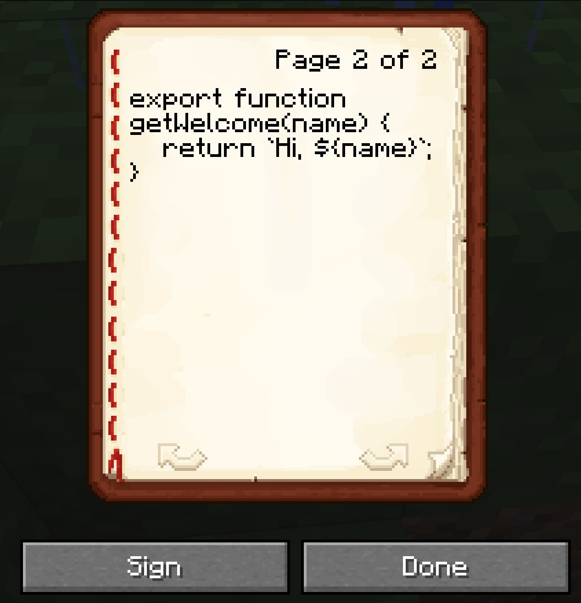
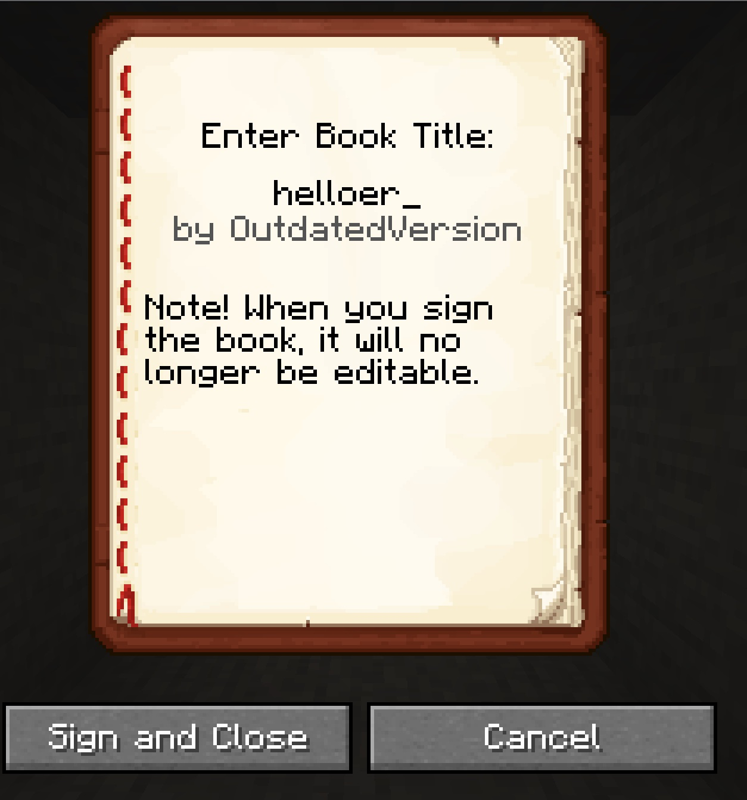
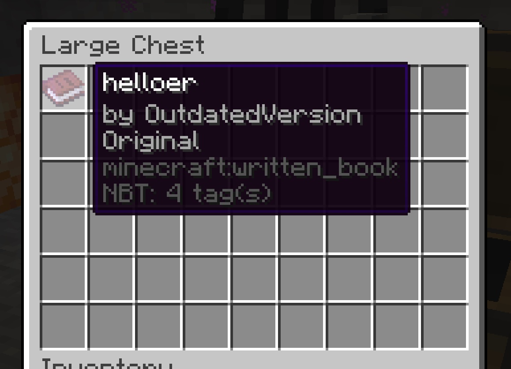
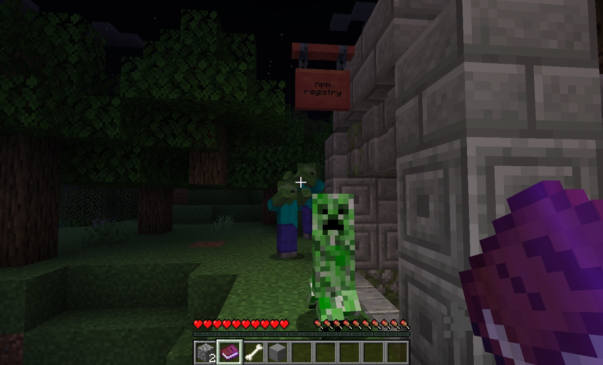
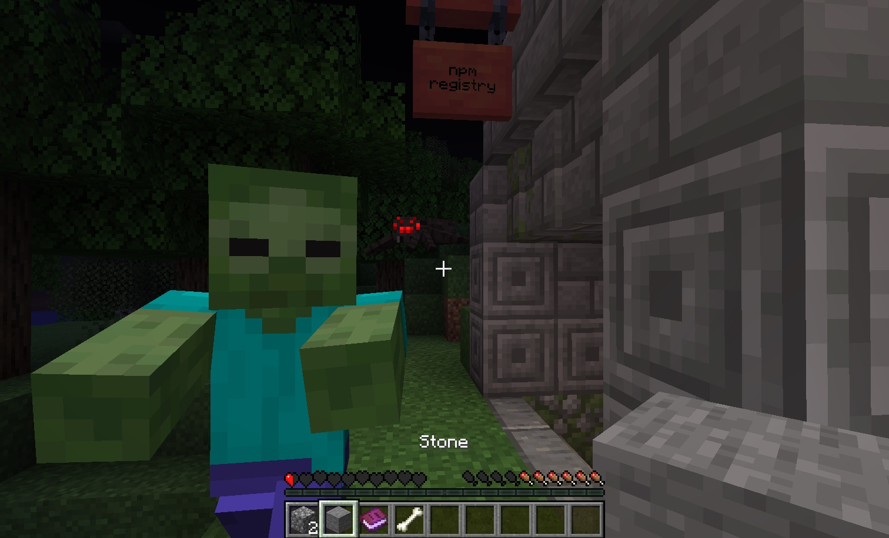

# Minecraft Node.js package loader

Load JavaScript packages from books in chests on a Minecraft server.

This will create a headless Minecraft client, join the configured server, and open
a chest to look for signed books.

Huge shoutout to the authors of `minecraft-protocol` and Prismarine. Their work
lets this simply stitch together some packages and patch a resolution quirk. 💙

## Usage

1.  **in-game:** Login to an offline mode Minecraft server (any version supported by [`minecraft-data`](https://npmjs.com/package/minecraft-data))

2.  **in-game:** Write your code in a book and quill

    > **Note**
    > The first line of the first page should be a semver string

    > **Note** > `import`ed packages will be loaded relative to the last on-disk module
    >
    > e.g. if `example.mjs` imports `minecraft:helloer`, any `import` in `helloer` will be
    > loaded as if you were in `example.mjs`.

    This could look something like:

    

    

3.  **in-game:** Sign your book and quill with the package name as the title

    

4.  **in-game:** Place your book, with any others, in a chest

    - This chest must be close enough to the configured player that it can open the chest
      without moving. This is 5 blocks away on an unmodified server. Keep in mind spawn
      protection prevents non OP-ed players from opening a chest (I forgot this and spent hours trying
      to fix the code 😅).

    

5.  Configure your shell's environment with the correct variables following [`.env.example`](./.env.example).

6.  Put together a consuming script locally (see `example.mjs`)

    ```js
    // example.mjs
    import * as helloer from 'minecraft:helloer';
    console.log(helloer);
    console.log(helloer.getWelcome('Cooper'));
    console.log(helloer.getDatedWelcome('Cooper'));
    ```

7.  Run script with the `--loader` flag

    ```console
    $ node --loader ./dist/loader.mjs example.mjs
    [Module: null prototype] {
    getDatedWelcome: [Function: getDatedWelcome],
    getWelcome: [Function: getWelcome]
    }
    Hi, Cooper
    Welcome to 2023, Cooper!
    ```

## Pros

- Enforce read and write policies with iron doors and a redstone lock!
- Signed books are immutable and traceable by default!
- Genuine team building built right into the release process!

## Cons

- Books may be lost without invader and blast proof entrances

  
  

## Wishlist

- npm compatible registry so the consumer doesn't need any non-standard dependencies
- Support teleporting the player (issue server command) so spawn location isn't a big deal
